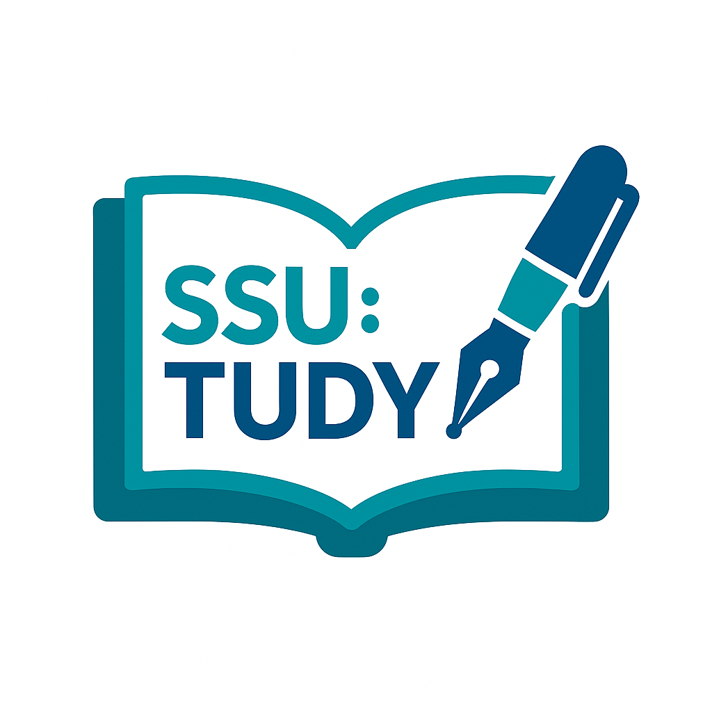

# SSU:TUDY
### Soongsil Univ. AI Convergence. 고급 프로그래밍 및 실습

### SSU:TUDY v1.0.0 (2024.06.15 released.)
> v1.0.0 변경점.
>> + main.cpp release.
>> + Front release.
>> + Back release.

이미 수강한 강의 데이터를 바탕으로 현재 수강중인 강의 성적을 예측하는 Web Service.

Other Project **[SSU_lms](https://github.com/Stardust322/SSU_LMS)** 

__Copyrights 2025. Lee SangHwa All rights reserved.__